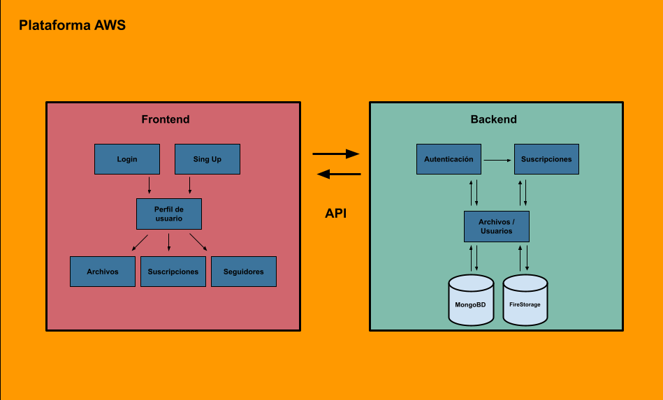

# Documentación del backend/API

## Controladores
La definción de los controladores fue basada en el requerimiento de tener la posibilidad de hacer revisión de la autenticación y estado de la suscripciones de los usarios en multiples endpoints de la API.

### Definición

* **auth.controller**: Contraldor para autenticación, este controlador se encarga de crear y verficar las fichas para autenticar a los usuarios utilizando librerías y técnicas seguras para la encriptación/desencriptación de información de los usuarios. Tambien en este controlador se realiza la creación y control de la sesiones de usuario, también se provee al frontend de la información necesaria para el manejo de las sesiones.

    * **createAccessToken**: Crea los tokens de sesión basados en la información de usuarios.
    * **checkSession**: Dado un token verifica la autenticidad del mismo y que aún represente una sesión con un tiempo de vida válido.
    * **decryptUserData**: Dato un token desencripta el token y consigue a partir de este la información del usuario

* **subscriptions.controller**: Controlador para el manejo de las suscripciones, el trabajo de este controlador es la verificación del estado de la suscripción del usuarios

    * **hardCheckSubscription**: Cuando un usuario realiza una petición a un endpoint inaccesible sin suscripción este manejador retorna al frontend un mensaje de error en el cual se determina que requiere una suscripción activa para seguir el proceso.
    * **softCheckSubscription**: Agrega a la petición información sobre el estado de la suscripción del usuario, esta funciona permite seguir con el proceso, en un contexto en el que se determinó el estado de la suscripción.

# Base de datos

## MongoBD

Base de datos no relacional utilizando el servicio de base de datos MongoDB donde se almacena la información de los usuarios y accesos encriptados a los archivos.

### Esquemas

#### User

Tabla de usuarios en la que se definen los usuarios, suscripciones, relaciones de amistad y archivos compartidos.

##### Campos:

* username: Nombre de usuario   

* email: Correo electrónico

* password: Contraseña

* subscription: Fecha de vencimiento de la suscripción

* followers: Seguidores

* following: Usuarios a quienes sigo

* sharedFiles: Usuarios compartidos

### Archivos

#### File

Esquema de archivos en la cual se guardan de forma encriptadas los accesos a los archivos de los usuarios.

##### Campos:

* userID

* desc

* hash

* baseDir

## FireStorage

Solución de Google para el almacenamiento de archivos de forma segura. Esta solución resolvió el problema del almacenamiento de los archivos de los usuarios y obtenerlos de forma segura y eficiente con gran ancho de banda para garatizar la mejor experiencia de subida y bajada de archivos

# Arquitectura

Para el diseño de la arquitectura de nuestra aplicación nos basamos en los modelos Cliente/Servidor separando nuestro proyecto en dos grandes componentes:
* Frontend: Diseño y desarrollo web ejecutado en el cliente del usuario, esta es lo que coloquialmente conocemos como "La parte visual" del proyecto ya que es con lo que el usuario interactura directamente. Utilizamos las técnologías Vue y Typescript para el desarrollo de este gran componente

* Backend: Procesamiento y lógica de negocio, encargado del manejo de usuario, suscripciones y archivos.

Para el intercambio entre estos dos componentes utilizados el concepto de una API, la cual es el intermediario encargado de la transferencia de información.

